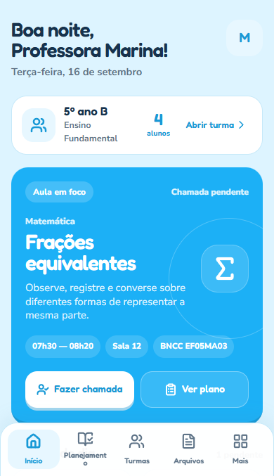
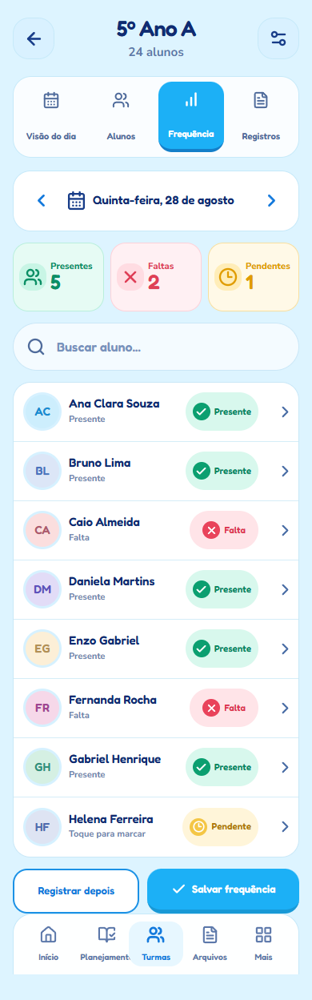
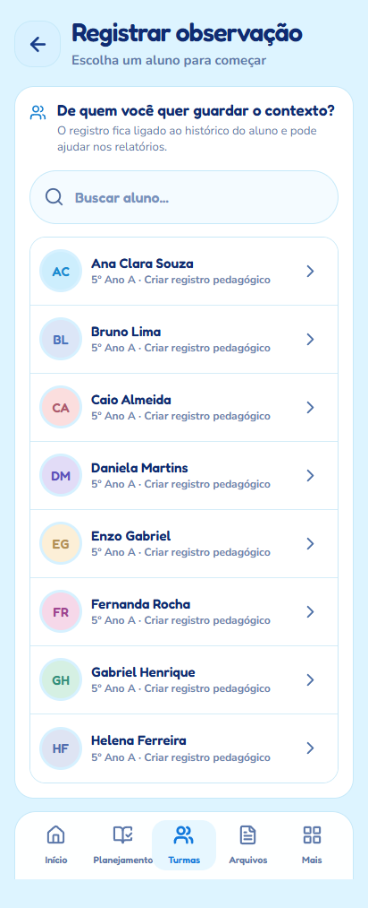
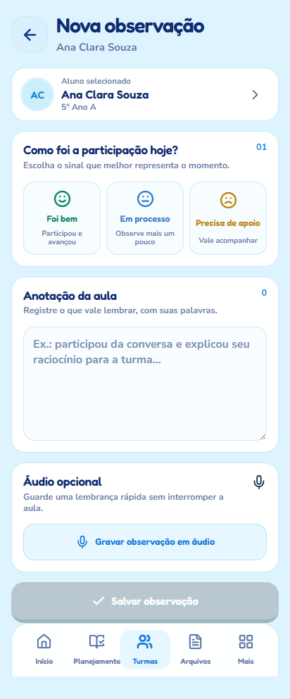
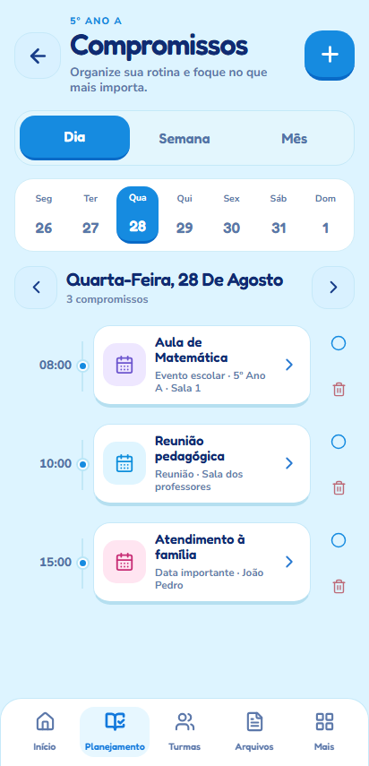
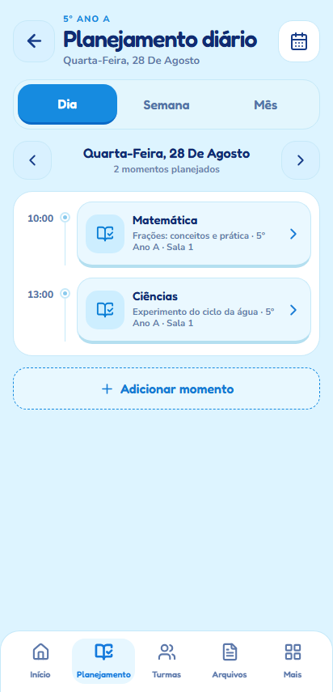
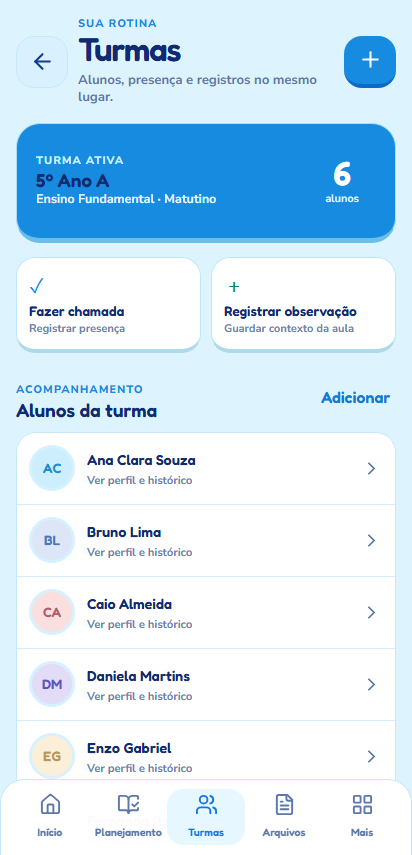

# Home V2 Clean Room — primeiro render

Branch: `codex/5-v2-clean-room`

PR: [#8](https://github.com/SayvaBR/assistente-ped/pull/8)

Esta captura registra uma iteração do render real da Home V2 no Visual Lab, em 390px — o viewport-âncora do target Lovable. A composição foi construída em `src/v2/` sem importar a arquitetura visual V1.

## O que este marco prova

- saudação/data e avatar de contexto;
- aula em foco como objeto dominante;
- ações `Fazer chamada` e `Ver plano`;
- dois comandos contextuais, sem grid de oito atalhos;
- agenda em timeline com estados de cor semânticos;
- navegação inferior com indicador de seleção;
- tipografia local Fredoka para títulos e Nunito Sans para corpo;
- ausência de truncamento essencial e overflow nos 7 stress points responsivos;
- adapter de produção que transforma perfil, turma, planos, frequência e agenda local em view-model V2;
- estado sem aula e agenda vazia preservado quando os dados reais não existem.

## Limite deste marco

O screenshot usa fixture sintética somente para comparação visual pública, sem dados de alunos. A Home no fluxo principal já recebe dados locais reais através do controlador existente, incluindo o estado sem aula/agenda observado no navegador. Persistência de ações e demais estados operacionais continuam sob o controlador/repositórios existentes e precisam de uma rodada específica de QA antes de `READY FOR DESIGN REVIEW — HOME V2`.

## Frequência V2 — primeiro fluxo do anel

O target operacional é a referência aprovada de Frequência: contexto da turma, tab Frequência selecionada, data, resumo semântico, busca, rows densas, status acionável, salvar e bottom navigation. A primeira implementação foi renderizada em `390px` e depois conectada à rota real `chamada` no `App`.

Evidência de continuidade usando fixture sintética:

- antes: [Home V2](home-to-frequency-before-390.png);
- depois de tocar `Fazer chamada`: [Frequência V2](home-to-frequency-after-390.png).

A captura pública não usa os dados locais do aparelho. A auditoria dos destinos restantes está em [V2_HOME_FLOW_MIGRATION_CHECKLIST.md](../../V2_HOME_FLOW_MIGRATION_CHECKLIST.md).

Estados exercitados no mesmo harness: [loading](frequency-v2-loading-390.png), [erro recuperável](frequency-v2-error-390.png), [offline](frequency-v2-offline-390.png) e [vazio](frequency-v2-empty-390.png).

Após o hardening adaptativo, também foi capturada a composição em [320px com texto ampliado a 150%](frequency-v2-stress-320-150.png). O teste usa a mesma composição fluida, reorganizando tabs, rows e ações sem quebrar palavras essenciais.

## Observação V2 — segundo fluxo do anel

A primeira composição em 412px cobre o picker de aluno e o formulário de observação: humor da participação, anotação livre, áudio opcional, CTA de salvamento e confirmação após a persistência. O fluxo E2E valida a escolha do aluno, preenchimento e feedback de salvamento.

## Compromissos / Agenda V2 — primeiro render

A primeira composição em 412px usa uma timeline diária com contexto de turma, seletor de data, compromissos semânticos, concluir/reabrir, excluir e editor de novo compromisso. A integração de produção preserva os contratos locais `Cp`/`Xf`.

## Planejamento diário V2 — primeiro render

A primeira composição do planejamento usa uma timeline de momentos, troca de dia, abertura do plano existente e criação de novo plano, com os dados reais do repositório de planejamento.

Também foram capturadas as composições de continuidade: [Semana](planning-week-v2-412.png) e [Mês](planning-month-v2-412.png).

## Turmas V2 — primeiro render

O overview de Turmas usa a turma ativa e os alunos reais do controlador, com ações de chamada, observação, perfil e cadastro.

