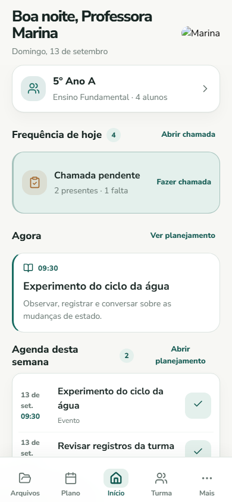
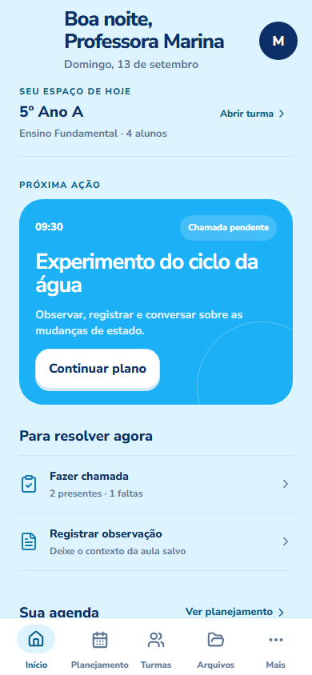
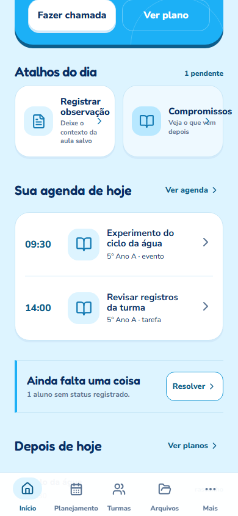
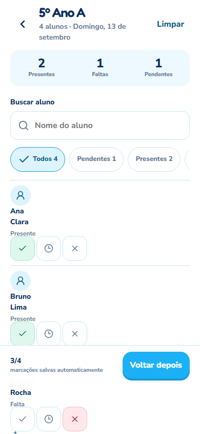
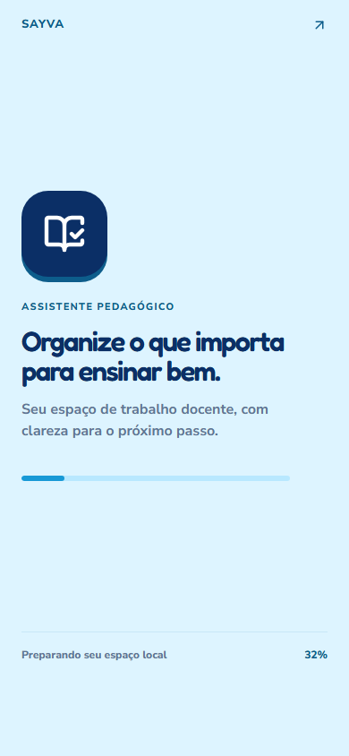

READY FOR DESIGN REVIEW — HOME V2

## O que mudou

Esta entrega estabelece a fundação visual V2 e porta a Home para a composição do projeto Lovable Pixel Perfect, preservando os contratos do aplicativo existente. A estrutura agora é saudação/data, `Aula em foco` azul com metadados e duas ações (`Fazer chamada`/`Ver plano`), `Atalhos do dia` (`Registrar observação`/`Compromissos`), agenda temporal e navegação inferior.

- referência visual e de fluxo registrada em `docs/LUNA-LOVABLE-EXECUTION.md` e `docs/DESIGN_AUTHORITY.md`;
- exportação dos arquivos centrais disponível em `C:/Users/Usuário/Desktop/ASSISTENTE 2/lovable-pixel-perfect-source/src`;
- composição Home sem grid legado de oito atalhos e sem dependência de ilustração para definir a identidade;
- agenda com estados loading/empty/error recuperável e conclusão persistida localmente;
- BottomNavigation V2 com cinco destinos estáveis;
- Splash sem mascote, com identidade de livro/check;
- Chamada/Frequência como prova de trabalho real, com estados de interação e persistência.

## Contratos preservados

Os dados continuam vindo dos repositories/domínio existentes (`storage`, `Cp`, `Xf`, `Mh`, `Ss`, `h0`, `S0`, `tp`). A gravação da frequência continua usando o fluxo original e a Home mantém navegação, armazenamento local, funcionamento offline, estados de erro e acessibilidade. Billing, LGPD e analytics não foram alterados; nenhum dado de aluno é enviado para analytics.

## Primitives V2 criadas

`AppShell`, `Screen`, `TopBar`, `BottomNavigation`, `Button`, `IconButton`, `Field`, `SearchField`, `SelectField`, `SegmentedControl`, `Chip`, `Surface`, `Row`, `SectionHeader`, `LoadingState`, `EmptyState`, `ErrorState`, `SuccessState`, `AvatarMark`, `DateBadge`, tokens de motion, `useReducedMotion()` e camada opt-in de haptics.

## Componentes V1 a aposentar/migrar

`Card`, `IconTile`, composições de grid 2×N da Home e blocos equivalentes derivados de `recovered.js` não ditam mais a linguagem da Home. Permanecem apenas onde ainda são necessários para compatibilidade funcional, com migração progressiva por tela. A Splash antiga com mascote deve ser aposentada quando o fluxo de entrada completo for migrado.

## Evidências visuais

[Comparação lado a lado com o target aprovado](home-target-side-by-side.png)

Gravação das microinterações: [motion-v2.webm](motion-v2.webm)

Métricas de viewport e touch targets: [viewport-metrics.json](viewport-metrics.json)

## Validação executada

- `pnpm build` — passou.
- `pnpm test` — passou: 12 arquivos, 46 testes.
- `node scripts/capture-v2-evidence.mjs` — passou; capturas 360px, 390px e 430px, estados loading/erro/offline/reduced motion e interação de chamada.
- `node scripts/android-sync.mjs` — passou.
- `node scripts/android-qa.mjs` — passou com geração do APK QA.
- `git diff --check` — sem erros de whitespace.
- Não há script `lint` declarado no `package.json`.
- A suíte E2E legada completa continua com falhas preexistentes em `e2e/academic-saving.pw.ts`; não foram tratadas como parte desta fundação visual.

## Decisão de revisão

A entrega está marcada como `READY FOR DESIGN REVIEW — HOME V2`. Isso não significa aprovação automática. A expansão visual para outras áreas deve aguardar revisão visual deste PR.
